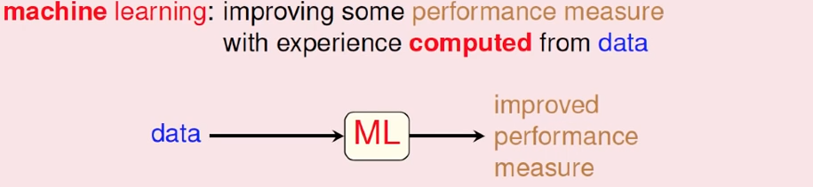

## 机器学习基石02_机器学习介绍
> 重点介绍内容：1.什么是机器学习？2.为什么需要使用机器学习？

**其实很长一段时间，只是学习了机器学习的算法，但是不知道为什么要用机器学习？机器学习本质上要解决什么类型的问题，这次课让我豁然开朗。这也是我觉得这门课程很好的原因。**

---

### 1.什么是机器学习？

#### 1.1 从人类学习的过程开始
主体：
	人类
示例：

1. 我们在学校里面上课，老师在黑板上面板书，讲授知识点，我们看教材，我们自己消化吸收这些知识点，最后变成了我们掌握的知识。
2. 小孩子看身边的人做各种不同的动作，说不同的内容，然后自己模仿动作或者模仿说话，慢慢自己学会做这些动作和说话。

归纳：
学习是一个从观察出发，经过我们大脑学习内化，变成有用的技巧过程。

#### 1.2 机器学习的过程   

机器学习其实是和我们人类学习过程比较类似的一个过程，只是相对应的部分有一些比较小的调整。
机器学习的过程简单的说，就是对一堆的数据(资料)，进行一系列的学习，最终形成一组技巧。   

那到底什么是技巧？  
技巧想要做的事情，就是要增强表现、提升性能。

### 2.为什么使用机器学习？

#### 2.1 引题
   
当你看到这个图片的时候，相信你很快在你的脑海里面得到一个结论：照片里面是一个'树'(手绘的树应该也算树)。没错，它是一棵树。  
第一个问题：你能不能通过程序识别这是一棵树？  
分析：(**假设不知道机器学习**)按照我们普通的程序的思路，无论是面向过程也好，或者是面向对象也好。一般的操作，我们会程序中假设很多的判断(相当于规则)，当符合某些情况的，我们可以认为是一个树。不符合某些情况，就不是一棵树。 
存在问题：  
1. 程序中的假设判断很困难
2. 准确性很差，图片变化性太大。
3. 写出来的程序很难有扩展性，只能针对某些特定的情况进行判断，超出就不能判断。

第二个问题：我们人类是怎么认识树？  
基本是第一部分介绍的内容差不多，通过我们最初的观察，以及别人的告诉，书本的学习，我们知道是树，什么不是树。   

第三个问题：我们如何通过机器学习来识别树？  
之前我们说了，机器学习是模仿我们人类学习的过程，如果我们一开始给我们的计算机提供很多关于树的图片，并且进行标注那些是树、那些不是树，让计算机在某些算法基础上形成一套规律，自主判断新图片那些是树、那些不是树。  
这样程序的适用性和扩展性都能得到增强。

#### 2.2 机器学习用另一种途径解决复杂系统问题

机器学习不是常规的采用构建复杂的规则以及软件系统去解决问题，而是采用另外的方式，根据已知的内容作为基础，通过分析学习已有数据，形成一套规则，进而把所得到的规则应用于新的事物上面。规则我们可能无法用准确具体的公式来进行描述，但是可以使用参数保留下来 。  
**使用机器学习的关键要素**   

使用机器学习的关键要素：  

1. 存在某些潜在的模式(用于确定提升的目标)，有潜在的规律和可量化的性能指标，才能给整个机器过程指明方向。
2. 很难用具体的程序代码(规则)来描述
3. 存在大量类似的相关历史操作或者数据，如果没有相关联的数据，也就失去了形成规律的基础。

#### 2.3 部分应用场景

1. 很难手动编写系统程序的场景
	- 运载机器人到火星，并使用机器人对火星环境考察
2. 很难具体描述解决方法的场景
	- 图像识别
	- 音频识别
3. 需要快速决策的场景
	- 股票交易中超级超短线
	- 量化交易
4. 个性化场景
	- 用户画像
	- 推荐系统

参考资料：

1. [coursera-机器学习基石(视频会有卡顿的情况)](https://www.coursera.org/learn/ntumlone-mathematicalfoundations)
2. [B站-机器学习基石(国内用户)](https://www.bilibili.com/video/BV1Cx411i7op)

---
>  备注：   
>  更多精彩博客，请访问:[聂发俊的技术博客](http://www.niefajun.com/)  
