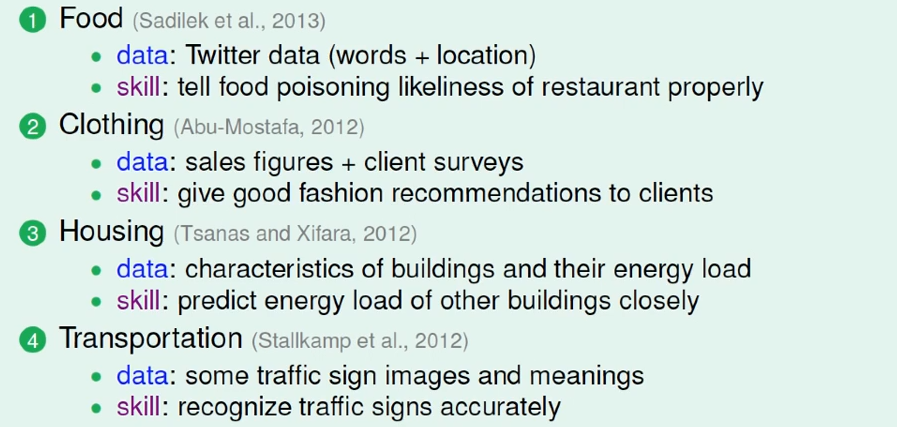
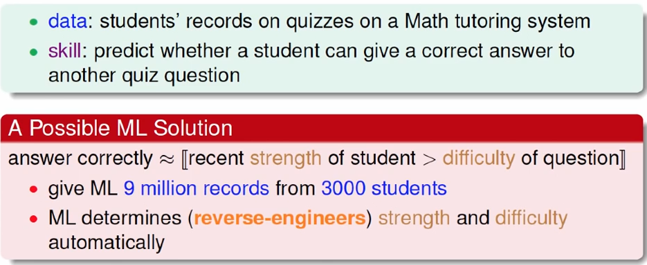
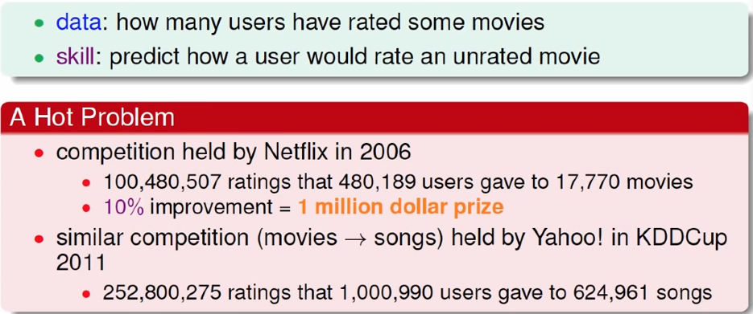

## 机器学习基石03_机器学习应用场景
>  本次课程主要是介绍性内容，介绍机器学习的主要的应用场景。

### 1. 在衣食住行中应用

1. 衣：根据销售数据以及用户相关数据，给用户推荐潮牌潮款
2. 食: 根据用户用餐数据推荐餐馆
3. 住：预测建筑物的能源消耗
4. 行：无人驾驶，目前滴滴的无人车业务已经登陆上海了

### 2.机器学习在教育中的应用

PPT里面介绍的内容，已经在国内很多教育公司推出的服务已经实现了。

### 3.机器学习在娱乐中的应用

1. Netflix电影推荐
2. 雅虎音乐推荐

